> **Lưu ý trạng thái tài liệu:** Tài liệu này là bản thiết kế/ghi chú kỹ thuật cũ và có một số phần không còn khớp hoàn toàn với workflow hiện tại trong code. Để xem hướng dẫn chạy, biến môi trường, cấu trúc hệ thống đang dùng và các lưu ý mới nhất, ưu tiên đọc `README.md`. Một số khái niệm như Claim Parser Agent, Evaluator chạy sau mỗi vòng hoặc cấu hình nhiều model có thể là định hướng thiết kế thay vì thành phần đang được nối trực tiếp trong workflow hiện tại.
# MAD System for Fake News Detection

## Multi-Agent Debate System — Thiết Kế Chi Tiết (v2)

> Hệ thống sử dụng nhiều agent LLM tranh luận với nhau để đánh giá độ tin cậy của một tin tức,
> lấy cảm hứng từ bài báo **Tool-MAD** (2026).

---

## 1. Tổng Quan Hệ Thống

### Mục tiêu
Xây dựng hệ thống multi-agent debate sử dụng LangGraph, trong đó các agent LLM đóng vai trò khác nhau để **tranh luận có cấu trúc** (theo từng nhận định) và **đánh giá** xem một tin tức có phải tin giả hay không, đưa ra **phần trăm tin cậy** kèm giải thích dựa trên **công thức tính điểm cho từng nhận định**.

### Kiến Trúc Tổng Quan

```
┌──────────────────────────────────────────────────────────────────┐
│                        USER INPUT                                │
│                   (Đoạn tin tức cần kiểm tra)                    │
└──────────────────────┬───────────────────────────────────────────┘
                       │
                       â–¼
              ┌─────────────────┐
              │  Claim Parser   │  Trích xuất các claim chính
              │     Agent       │  từ đoạn tin tức
              └────────┬────────┘
                       │
                       â–¼
              ┌─────────────────┐
              │  Knowledge      │  Tìm kiếm trên Wikipedia
              │  Researcher     │  → Xây dựng Knowledge Base chung
              └────────┬────────┘
                       │
           ┌───────────┴───────────┐
           │                       │
           â–¼                       â–¼
   ┌───────────────┐      ┌───────────────┐
   │   Defender     │      │  Challenger    │    Tranh luận
   │   Agent        │      │  Agent         │    có cấu trúc
   │ (Tin thật)     │      │ (Tin giả)      │    theo nhận định
   └───────┬───────┘      └───────┬────────┘
           │                       │
           └───────────┬───────────┘
                       │
                       â–¼
              ┌─────────────────┐
              │   Evaluator     │  Đánh giá mỗi vòng
              │   Agent         │  CONFIRM / REJECT / KEEP claims
              └────────┬────────┘
                       │
                  (Lặp lại nếu chưa đủ vòng)
                       │
                       â–¼
              ┌─────────────────┐
              │   Judge Agent   │  Tính điểm từng nhận định
              │                 │  credibility × reliability × relevance
              └────────┬────────┘
                       │
                       â–¼
              ┌─────────────────┐
              │    KẾT QUẢ      │  % tin cậy + bảng điểm
              │                 │  từng nhận định
              └─────────────────┘
```

---

## 2. Các Agent Chi Tiết

### 2.1. Claim Parser Agent

| Thuộc tính | Chi tiết |
|------------|----------|
| **Vai trò** | Trích xuất các claim (tuyên bố) chính từ đoạn tin tức |
| **Input** | Đoạn tin tức gốc từ user |
| **Output** | Danh sách claims cần xác minh |
| **Tool** | Không |

---

### 2.2. Knowledge Researcher Agent (MỚI)

| Thuộc tính | Chi tiết |
|------------|----------|
| **Vai trò** | Tìm kiếm kiến thức nền tảng từ Wikipedia trước khi tranh luận |
| **Input** | Claims đã trích xuất |
| **Output** | Knowledge Base chung (danh sách kết quả Wikipedia) |
| **Tool** | Wikipedia API (thư viện `wikipedia`) |

**Quy trình:**
1. Dùng LLM để tạo 3-6 search queries từ claims
2. Tìm kiếm trên Wikipedia (tiếng Việt + tiếng Anh)
3. Lưu kết quả vào `knowledge_base` — nguồn kiến thức chung cho CẢ HAI bên

**Tại sao cần?**
- Cung cấp kiến thức thực tế cho agents thay vì dựa vào hallucination của LLM
- Đảm bảo cả hai bên có cùng một nguồn thông tin khách quan
- Giới hạn agents chỉ dùng thông tin đã xác minh hoặc kiến thức CỰC KỲ phổ thông

---

### 2.3. Defender Agent (Bảo Vệ Tin Thật)

| Thuộc tính | Chi tiết |
|------------|----------|
| **Vai trò** | Lập luận rằng tin tức là **THẬT** |
| **Input** | Claims + Knowledge Base + Lịch sử tranh luận |
| **Output** | Nhận định có cấu trúc [D1], [D2]... |
| **Tool** | Không |

### 2.4. Challenger Agent (Bảo Vệ Tin Giả)

| Thuộc tính | Chi tiết |
|------------|----------|
| **Vai trò** | Lập luận rằng tin tức là **GIẢ** |
| **Input** | Claims + Knowledge Base + Lịch sử tranh luận |
| **Output** | Nhận định có cấu trúc [C1], [C2]... |
| **Tool** | Không |

#### Cấu trúc tranh luận theo vòng

**Vòng 1 — Nêu nhận định ban đầu:**
- Mỗi agent ĐỘC LẬP đưa ra 3-5 nhận định
- Format: `[D1] (Nguồn: Wikipedia | Credibility: 0.65) Nội dung...`
- Chỉ được dùng: Knowledge Base + kiến thức CỰC KỲ phổ thông + logic
- Hai bên KHÔNG thấy nhận định của nhau

**Vòng 2 — Phản biện:**
- Mỗi agent phản biện nhận định CỤ THỂ của đối phương
- Phải chỉ rõ: `### Phản biện [C1]: "nội dung nhận định"`
- Mỗi nhận định tranh luận trong một BLOCK riêng

**Vòng 3+ — Bảo vệ + Phản biện tiếp:**
- Agent BẢO VỆ nhận định bị phản biện ở vòng trước
- Agent có thể TIẾP TỤC phản biện nhận định đối phương
- Chỉ phản hồi nội dung VÒNG TRƯỚC (không phản hồi trong cùng vòng)
- Chỉ tranh luận nhận định còn ACTIVE (chưa bị Evaluator kết luận)
- Tất cả tổ chức theo BLOCK từng nhận định

---

### 2.5. Evaluator Agent (thay thế Moderator cũ)

| Thuộc tính | Chi tiết |
|------------|----------|
| **Vai trò** | Đánh giá và phán quyết từng nhận định sau mỗi vòng |
| **Input** | Lịch sử tranh luận + Knowledge Base + Evaluator rulings trước |
| **Output** | Danh sách quyết định: CONFIRM / REJECT / KEEP cho mỗi nhận định |
| **Tool** | Không |

**Quyền hạn:**
1. **CONFIRM** — Xác nhận nhận định đúng → Chấm dứt tranh luận về nhận định đó
2. **REJECT** — Bác bỏ nhận định nếu:
   - Không có bằng chứng (không trong Knowledge Base)
   - Không phải kiến thức cực kỳ phổ thông mà tự xưng là phổ thông
   - Không liên quan đến vấn đề đang tranh luận
   - Agent không bảo vệ được trước phản biện hợp lý
3. **KEEP** — Giữ nguyên để tiếp tục tranh luận

---

### 2.6. Judge Agent (Phán Quyết Cuối Cùng)

| Thuộc tính | Chi tiết |
|------------|----------|
| **Vai trò** | Tính điểm từng nhận định và đưa ra phán quyết tổng thể |
| **Input** | Toàn bộ lịch sử + Evaluator rulings + Knowledge Base |
| **Output** | Bảng điểm từng nhận định + Verdict + Confidence |
| **Tool** | Không |

#### Công thức tính điểm

Mỗi nhận định được tính:
```
score(claim) = source_credibility × reliability × relevance
```

| Yếu tố | Giá trị | Mô tả |
|---------|---------|-------|
| **source_credibility** | 1.0 | Kiến thức phổ thông |
| | 0.65 | Wikipedia |
| | 0.5 | Logic thuần |
| | 0.2 | Không xác minh |
| **reliability** | 1.0 | Đã CONFIRM hoặc kiến thức phổ thông |
| | 0.6-0.8 | Đang tranh luận, có hỗ trợ tốt |
| | 0.1-0.3 | Bị phản bác mạnh |
| | 0.0 | Bị REJECT |
| **relevance** | 0.0-1.0 | Mức độ liên quan và giá trị đối với vấn đề |

**Tổng điểm mỗi bên:**
```
total_score(side) = Σ score(claim_i)  for all claims of that side
```

So sánh `total_score(DEFENDER)` vs `total_score(CHALLENGER)` để đưa ra verdict.

---

## 3. Flow Chi Tiết

### Vòng 0: Khởi Tạo

```
User nhập tin tức
    │
    â–¼
Claim Parser trích xuất claims
    │
    â–¼
Knowledge Researcher tìm kiếm Wikipedia
    │ (tạo queries → search vi + en → lưu knowledge_base)
    │
    â–¼
Knowledge Base sẵn sàng cho tranh luận
```

### Vòng 1: Nhận Định Ban Đầu

```
Defender nhận claims + knowledge_base
    → Đưa ra nhận định [D1], [D2], [D3]... (ĐỘC LẬP)
    → Mỗi nhận định ghi rõ nguồn + credibility

Challenger nhận claims + knowledge_base (KHÔNG thấy Defender)
    → Đưa ra nhận định [C1], [C2], [C3]...
    → Mỗi nhận định ghi rõ nguồn + credibility

Evaluator đánh giá:
    → Bác bỏ nhận định không có cơ sở
    → Xác nhận nhận định hiển nhiên
    → Giữ nhận định cần tranh luận thêm
```

### Vòng 2: Phản Biện

```
Defender ĐỌC lập luận Challenger Vòng 1 (từ debate_history)
    → Phản biện từng nhận định [C?] trong block riêng
    → Bảo vệ [D?] nếu cần

Challenger ĐỌC lập luận Defender Vòng 1 (từ debate_history)
    → Phản biện từng nhận định [D?] trong block riêng
    → Bảo vệ [C?] nếu cần

(Cả hai chỉ đọc VÒNG TRƯỚC, không đọc lẫn nhau trong vòng hiện tại)

Evaluator đánh giá:
    → CONFIRM/REJECT/KEEP các nhận định dựa trên phản biện
```

### Vòng 3+: Bảo Vệ + Phản Biện Tiếp

```
Tương tự Vòng 2 nhưng:
- CHỈ tranh luận nhận định ACTIVE
- Có thể bảo vệ nhận định bị phản biện
- CÓ THỂ tiếp tục phản biện nhận định đối phương
- Mỗi nhận định một block riêng
```

### Vòng Cuối: Judge Phán Quyết

```
Judge nhận TOÀN BỘ:
    ├── Claims gốc
    ├── Knowledge Base
    ├── Tất cả debate history
    └── Tất cả evaluator rulings
    │
    â–¼
Tính điểm: score = credibility × reliability × relevance
    │
    â–¼
Total Defender vs Total Challenger → Verdict
```

---

## 4. Stack Công Nghệ

| Component | Công nghệ | Ghi chú |
|-----------|-----------|---------|
| **Orchestration** | LangGraph | State machine quản lý debate flow |
| **LLM API** | Groq (Llama 3.3 70B) | Model chính cho agents |
| **Web Search** | Wikipedia API | Thư viện `wikipedia` Python, hỗ trợ đa ngôn ngữ |
| **Source Whitelist** | Config file (Python) | Danh sách nguồn + credibility tier |
| **Frontend** | Gradio | Demo UI vá»›i streaming |
| **Language** | Python | — |

---

## 5. LangGraph State & Graph

### State Definition

```python
class MADState(TypedDict):
    original_news: str
    claims: list[str]
    knowledge_base: Annotated[list[KnowledgeEntry], add_to_list]
    search_results: Annotated[list[dict], add_to_list]
    pending_search_queries: list[str]
    current_round: int
    max_rounds: int
    debate_history: Annotated[list[DebateRound], add_to_list]
    current_defender_argument: str
    current_challenger_argument: str
    evaluator_rulings: Annotated[list[dict], add_to_list]
    verdict: dict | None
```

### Graph Flow

```mermaid
graph TD
    START([Start]) --> PARSE[Claim Parser]
    PARSE --> RESEARCH[Knowledge Researcher<br/>Wikipedia Search]
    RESEARCH --> DEF[Defender<br/>Nêu nhận định / Phản biện / Bảo vệ]
    DEF --> CHAL[Challenger<br/>Nêu nhận định / Phản biện / Bảo vệ]
    CHAL --> SAVE[Save Round]
    SAVE --> EVAL[Evaluator<br/>CONFIRM / REJECT / KEEP]
    EVAL --> CHECK{Đạt max<br/>rounds?}
    CHECK -->|ChÆ°a| DEF
    CHECK -->|Rồi| JUDGE[Judge<br/>Tính điểm & Phán quyết]
    JUDGE --> END([Kết quả])
```



---

## 6. Ví Dụ Minh Họa

### Input
> "Theo nghiên cứu của Đại học Harvard năm 2024, uống 3 ly cà phê mỗi ngày
> giúp giảm 50% nguy cơ ung thư gan."

### Knowledge Researcher
Wikipedia search: "Harvard University", "Cà phê", "Ung thư gan", "Caffeine health effects"

### Vòng 1

**Defender:**
```
[D1] (Nguồn: Wikipedia | Credibility: 0.65) Harvard thực sự là trường đại học nghiên cứu hàng đầu...
[D2] (Nguồn: Wikipedia | Credibility: 0.65) Cà phê có chứa các chất chống oxy hóa...
[D3] (Nguồn: Kiến thức phổ thông | Credibility: 1.0) WHO là tổ chức y tế quốc tế uy tín...
```

**Challenger:**
```
[C1] (Nguồn: Logic | Credibility: 0.5) Con số "giảm 50%" rất cao, các nghiên cứu y khoa thường cho kết quả khiêm tốn hơn
[C2] (Nguồn: Wikipedia | Credibility: 0.65) Không tìm thấy nghiên cứu Harvard 2024 cụ thể về cà phê và ung thư gan
[C3] (Nguồn: Logic | Credibility: 0.5) Tin tức không dẫn nguồn cụ thể, không có DOI hoặc link
```

**Evaluator:**
```
✅ CONFIRM [D3]: WHO là tổ chức y tế quốc tế — Kiến thức phổ thông
🔄 KEEP [D1], [D2], [C1], [C2], [C3] — Cần tranh luận thêm
```

### Vòng 2

**Defender:**
```
### Phản biện [C1]: "Con số 50% rất cao..."
Cà phê đã được nhiều nghiên cứu chứng minh... (theo Wikipedia)

### Phản biện [C2]: "Không tìm thấy nghiên cứu Harvard..."
Thừa nhận chưa tìm được nghiên cứu cụ thể nhưng Harvard có nhiều nghiên cứu...
```

**Challenger:**
```
### Phản biện [D1]: "Harvard là trường nghiên cứu hàng đầu"
Không ai phủ nhận Harvard uy tín, nhưng điều đó không chứng minh tin tức đúng

### Phản biện [D2]: "Cà phê có chất chống oxy hóa"
Đúng nhưng "có chất chống oxy hóa" ≠ "giảm 50% ung thư gan"
```

**Evaluator:**
```
✅ CONFIRM [D1]: Harvard là trường uy tín — nhưng không chứng minh tin đúng
❌ REJECT [D2]: Không liên quan trực tiếp — "có chất chống oxy hóa" ≠ giảm 50% ung thư
🔄 KEEP [C1], [C2], [C3]
```

### Judge Verdict

```json
{
  "claim_scores": [
    {"claim_id": "[C1]", "side": "CHALLENGER", "source_credibility": 0.5,
     "reliability": 0.7, "relevance": 0.9, "score": 0.315},
    {"claim_id": "[C2]", "side": "CHALLENGER", "source_credibility": 0.65,
     "reliability": 0.8, "relevance": 0.95, "score": 0.494},
    {"claim_id": "[C3]", "side": "CHALLENGER", "source_credibility": 0.5,
     "reliability": 0.8, "relevance": 0.8, "score": 0.320}
  ],
  "defender_total": 0.0,
  "challenger_total": 1.129,
  "verdict": "LIKELY_FAKE",
  "confidence": 82
}
```

