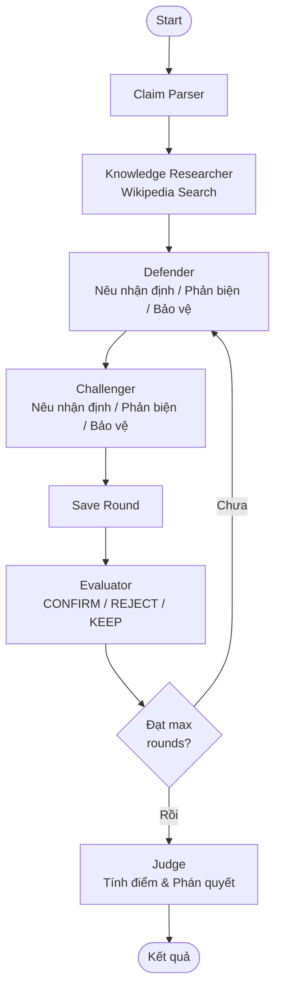

# MAD System for Fake News Detection

## Multi-Agent Debate System — Thiết Kế Chi Tiết (v2)

> Hệ thống sử dụng nhiều agent LLM tranh luận với nhau để đánh giá độ tin cậy của một tin tức,
> lấy cảm hứng từ bài báo **Tool-MAD** (2026).

---

## 1. Tổng Quan Hệ Thống

### Mục tiêu
Xây dựng hệ thống multi-agent debate sử dụng LangGraph, trong đó các agent LLM đóng vai trò khác nhau để **tranh luận có cấu trúc** (theo từng nhận định) và **đánh giá** xem một tin tức có phải tin giả hay không, đưa ra **phần trăm tin cậy** kèm giải thích dựa trên **công thức tính điểm cho từng nhận định**.

### Kiến Trúc Tổng Quan

```
┌──────────────────────────────────────────────────────────────────┐
│                        USER INPUT                                │
│                   (Đoạn tin tức cần kiểm tra)                    │
└──────────────────────┬───────────────────────────────────────────┘
                       │
                       ▼
              ┌─────────────────┐
              │  Claim Parser   │  Trích xuất các claim chính
              │     Agent       │  từ đoạn tin tức
              └────────┬────────┘
                       │
                       ▼
              ┌─────────────────┐
              │  Knowledge      │  Tìm kiếm trên Wikipedia
              │  Researcher     │  → Xây dựng Knowledge Base chung
              └────────┬────────┘
                       │
           ┌───────────┴───────────┐
           │                       │
           ▼                       ▼
   ┌───────────────┐      ┌───────────────┐
   │   Defender     │      │  Challenger    │    Tranh luận
   │   Agent        │      │  Agent         │    có cấu trúc
   │ (Tin thật)     │      │ (Tin giả)      │    theo nhận định
   └───────┬───────┘      └───────┬────────┘
           │                       │
           └───────────┬───────────┘
                       │
                       ▼
              ┌─────────────────┐
              │   Evaluator     │  Đánh giá mỗi vòng
              │   Agent         │  CONFIRM / REJECT / KEEP claims
              └────────┬────────┘
                       │
                  (Lặp lại nếu chưa đủ vòng)
                       │
                       ▼
              ┌─────────────────┐
              │   Judge Agent   │  Tính điểm từng nhận định
              │                 │  credibility × reliability × relevance
              └────────┬────────┘
                       │
                       ▼
              ┌─────────────────┐
              │    KẾT QUẢ      │  % tin cậy + bảng điểm
              │                 │  từng nhận định
              └─────────────────┘
```

---

## 2. Các Agent Chi Tiết

### 2.1. Claim Parser Agent

| Thuộc tính | Chi tiết |
|------------|----------|
| **Vai trò** | Trích xuất các claim (tuyên bố) chính từ đoạn tin tức |
| **Input** | Đoạn tin tức gốc từ user |
| **Output** | Danh sách claims cần xác minh |
| **Tool** | Không |

---

### 2.2. Knowledge Researcher Agent (MỚI)

| Thuộc tính | Chi tiết |
|------------|----------|
| **Vai trò** | Tìm kiếm kiến thức nền tảng từ Wikipedia trước khi tranh luận |
| **Input** | Claims đã trích xuất |
| **Output** | Knowledge Base chung (danh sách kết quả Wikipedia) |
| **Tool** | Wikipedia API (thư viện `wikipedia`) |

**Quy trình:**
1. Dùng LLM để tạo 3-6 search queries từ claims
2. Tìm kiếm trên Wikipedia (tiếng Việt + tiếng Anh)
3. Lưu kết quả vào `knowledge_base` — nguồn kiến thức chung cho CẢ HAI bên

**Tại sao cần?**
- Cung cấp kiến thức thực tế cho agents thay vì dựa vào hallucination của LLM
- Đảm bảo cả hai bên có cùng một nguồn thông tin khách quan
- Giới hạn agents chỉ dùng thông tin đã xác minh hoặc kiến thức CỰC KỲ phổ thông

---

### 2.3. Defender Agent (Bảo Vệ Tin Thật)

| Thuộc tính | Chi tiết |
|------------|----------|
| **Vai trò** | Lập luận rằng tin tức là **THẬT** |
| **Input** | Claims + Knowledge Base + Lịch sử tranh luận |
| **Output** | Nhận định có cấu trúc [D1], [D2]... |
| **Tool** | Không |

### 2.4. Challenger Agent (Bảo Vệ Tin Giả)

| Thuộc tính | Chi tiết |
|------------|----------|
| **Vai trò** | Lập luận rằng tin tức là **GIẢ** |
| **Input** | Claims + Knowledge Base + Lịch sử tranh luận |
| **Output** | Nhận định có cấu trúc [C1], [C2]... |
| **Tool** | Không |

#### Cấu trúc tranh luận theo vòng

**Vòng 1 — Nêu nhận định ban đầu:**
- Mỗi agent ĐỘC LẬP đưa ra 3-5 nhận định
- Format: `[D1] (Nguồn: Wikipedia | Credibility: 0.65) Nội dung...`
- Chỉ được dùng: Knowledge Base + kiến thức CỰC KỲ phổ thông + logic
- Hai bên KHÔNG thấy nhận định của nhau

**Vòng 2 — Phản biện:**
- Mỗi agent phản biện nhận định CỤ THỂ của đối phương
- Phải chỉ rõ: `### Phản biện [C1]: "nội dung nhận định"`
- Mỗi nhận định tranh luận trong một BLOCK riêng

**Vòng 3+ — Bảo vệ + Phản biện tiếp:**
- Agent BẢO VỆ nhận định bị phản biện ở vòng trước
- Agent có thể TIẾP TỤC phản biện nhận định đối phương
- Chỉ phản hồi nội dung VÒNG TRƯỚC (không phản hồi trong cùng vòng)
- Chỉ tranh luận nhận định còn ACTIVE (chưa bị Evaluator kết luận)
- Tất cả tổ chức theo BLOCK từng nhận định

---

### 2.5. Evaluator Agent (thay thế Moderator cũ)

| Thuộc tính | Chi tiết |
|------------|----------|
| **Vai trò** | Đánh giá và phán quyết từng nhận định sau mỗi vòng |
| **Input** | Lịch sử tranh luận + Knowledge Base + Evaluator rulings trước |
| **Output** | Danh sách quyết định: CONFIRM / REJECT / KEEP cho mỗi nhận định |
| **Tool** | Không |

**Quyền hạn:**
1. **CONFIRM** — Xác nhận nhận định đúng → Chấm dứt tranh luận về nhận định đó
2. **REJECT** — Bác bỏ nhận định nếu:
   - Không có bằng chứng (không trong Knowledge Base)
   - Không phải kiến thức cực kỳ phổ thông mà tự xưng là phổ thông
   - Không liên quan đến vấn đề đang tranh luận
   - Agent không bảo vệ được trước phản biện hợp lý
3. **KEEP** — Giữ nguyên để tiếp tục tranh luận

---

### 2.6. Judge Agent (Phán Quyết Cuối Cùng)

| Thuộc tính | Chi tiết |
|------------|----------|
| **Vai trò** | Tính điểm từng nhận định và đưa ra phán quyết tổng thể |
| **Input** | Toàn bộ lịch sử + Evaluator rulings + Knowledge Base |
| **Output** | Bảng điểm từng nhận định + Verdict + Confidence |
| **Tool** | Không |

#### Công thức tính điểm

Mỗi nhận định được tính:
```
score(claim) = source_credibility × reliability × relevance
```

| Yếu tố | Giá trị | Mô tả |
|---------|---------|-------|
| **source_credibility** | 1.0 | Kiến thức phổ thông |
| | 0.65 | Wikipedia |
| | 0.5 | Logic thuần |
| | 0.2 | Không xác minh |
| **reliability** | 1.0 | Đã CONFIRM hoặc kiến thức phổ thông |
| | 0.6-0.8 | Đang tranh luận, có hỗ trợ tốt |
| | 0.1-0.3 | Bị phản bác mạnh |
| | 0.0 | Bị REJECT |
| **relevance** | 0.0-1.0 | Mức độ liên quan và giá trị đối với vấn đề |

**Tổng điểm mỗi bên:**
```
total_score(side) = Σ score(claim_i)  for all claims of that side
```

So sánh `total_score(DEFENDER)` vs `total_score(CHALLENGER)` để đưa ra verdict.

---

## 3. Flow Chi Tiết

### Vòng 0: Khởi Tạo

```
User nhập tin tức
    │
    ▼
Claim Parser trích xuất claims
    │
    ▼
Knowledge Researcher tìm kiếm Wikipedia
    │ (tạo queries → search vi + en → lưu knowledge_base)
    │
    ▼
Knowledge Base sẵn sàng cho tranh luận
```

### Vòng 1: Nhận Định Ban Đầu

```
Defender nhận claims + knowledge_base
    → Đưa ra nhận định [D1], [D2], [D3]... (ĐỘC LẬP)
    → Mỗi nhận định ghi rõ nguồn + credibility

Challenger nhận claims + knowledge_base (KHÔNG thấy Defender)
    → Đưa ra nhận định [C1], [C2], [C3]...
    → Mỗi nhận định ghi rõ nguồn + credibility

Evaluator đánh giá:
    → Bác bỏ nhận định không có cơ sở
    → Xác nhận nhận định hiển nhiên
    → Giữ nhận định cần tranh luận thêm
```

### Vòng 2: Phản Biện

```
Defender ĐỌC lập luận Challenger Vòng 1 (từ debate_history)
    → Phản biện từng nhận định [C?] trong block riêng
    → Bảo vệ [D?] nếu cần

Challenger ĐỌC lập luận Defender Vòng 1 (từ debate_history)
    → Phản biện từng nhận định [D?] trong block riêng
    → Bảo vệ [C?] nếu cần

(Cả hai chỉ đọc VÒNG TRƯỚC, không đọc lẫn nhau trong vòng hiện tại)

Evaluator đánh giá:
    → CONFIRM/REJECT/KEEP các nhận định dựa trên phản biện
```

### Vòng 3+: Bảo Vệ + Phản Biện Tiếp

```
Tương tự Vòng 2 nhưng:
- CHỈ tranh luận nhận định ACTIVE
- Có thể bảo vệ nhận định bị phản biện
- CÓ THỂ tiếp tục phản biện nhận định đối phương
- Mỗi nhận định một block riêng
```

### Vòng Cuối: Judge Phán Quyết

```
Judge nhận TOÀN BỘ:
    ├── Claims gốc
    ├── Knowledge Base
    ├── Tất cả debate history
    └── Tất cả evaluator rulings
    │
    ▼
Tính điểm: score = credibility × reliability × relevance
    │
    ▼
Total Defender vs Total Challenger → Verdict
```

---

## 4. Stack Công Nghệ

| Component | Công nghệ | Ghi chú |
|-----------|-----------|---------|
| **Orchestration** | LangGraph | State machine quản lý debate flow |
| **LLM API** | Groq (Llama 3.3 70B) | Model chính cho agents |
| **Web Search** | Wikipedia API | Thư viện `wikipedia` Python, hỗ trợ đa ngôn ngữ |
| **Source Whitelist** | Config file (Python) | Danh sách nguồn + credibility tier |
| **Frontend** | Gradio | Demo UI với streaming |
| **Language** | Python | — |

---

## 5. LangGraph State & Graph

### State Definition

```python
class MADState(TypedDict):
    original_news: str
    claims: list[str]
    knowledge_base: Annotated[list[KnowledgeEntry], add_to_list]
    search_results: Annotated[list[dict], add_to_list]
    pending_search_queries: list[str]
    current_round: int
    max_rounds: int
    debate_history: Annotated[list[DebateRound], add_to_list]
    current_defender_argument: str
    current_challenger_argument: str
    evaluator_rulings: Annotated[list[dict], add_to_list]
    verdict: dict | None
```

### Graph Flow



---

## 6. Ví Dụ Minh Họa

### Input
> "Theo nghiên cứu của Đại học Harvard năm 2024, uống 3 ly cà phê mỗi ngày
> giúp giảm 50% nguy cơ ung thư gan."

### Knowledge Researcher
Wikipedia search: "Harvard University", "Cà phê", "Ung thư gan", "Caffeine health effects"

### Vòng 1

**Defender:**
```
[D1] (Nguồn: Wikipedia | Credibility: 0.65) Harvard thực sự là trường đại học nghiên cứu hàng đầu...
[D2] (Nguồn: Wikipedia | Credibility: 0.65) Cà phê có chứa các chất chống oxy hóa...
[D3] (Nguồn: Kiến thức phổ thông | Credibility: 1.0) WHO là tổ chức y tế quốc tế uy tín...
```

**Challenger:**
```
[C1] (Nguồn: Logic | Credibility: 0.5) Con số "giảm 50%" rất cao, các nghiên cứu y khoa thường cho kết quả khiêm tốn hơn
[C2] (Nguồn: Wikipedia | Credibility: 0.65) Không tìm thấy nghiên cứu Harvard 2024 cụ thể về cà phê và ung thư gan
[C3] (Nguồn: Logic | Credibility: 0.5) Tin tức không dẫn nguồn cụ thể, không có DOI hoặc link
```

**Evaluator:**
```
✅ CONFIRM [D3]: WHO là tổ chức y tế quốc tế — Kiến thức phổ thông
🔄 KEEP [D1], [D2], [C1], [C2], [C3] — Cần tranh luận thêm
```

### Vòng 2

**Defender:**
```
### Phản biện [C1]: "Con số 50% rất cao..."
Cà phê đã được nhiều nghiên cứu chứng minh... (theo Wikipedia)

### Phản biện [C2]: "Không tìm thấy nghiên cứu Harvard..."
Thừa nhận chưa tìm được nghiên cứu cụ thể nhưng Harvard có nhiều nghiên cứu...
```

**Challenger:**
```
### Phản biện [D1]: "Harvard là trường nghiên cứu hàng đầu"
Không ai phủ nhận Harvard uy tín, nhưng điều đó không chứng minh tin tức đúng

### Phản biện [D2]: "Cà phê có chất chống oxy hóa"
Đúng nhưng "có chất chống oxy hóa" ≠ "giảm 50% ung thư gan"
```

**Evaluator:**
```
✅ CONFIRM [D1]: Harvard là trường uy tín — nhưng không chứng minh tin đúng
❌ REJECT [D2]: Không liên quan trực tiếp — "có chất chống oxy hóa" ≠ giảm 50% ung thư
🔄 KEEP [C1], [C2], [C3]
```

### Judge Verdict

```json
{
  "claim_scores": [
    {"claim_id": "[C1]", "side": "CHALLENGER", "source_credibility": 0.5,
     "reliability": 0.7, "relevance": 0.9, "score": 0.315},
    {"claim_id": "[C2]", "side": "CHALLENGER", "source_credibility": 0.65,
     "reliability": 0.8, "relevance": 0.95, "score": 0.494},
    {"claim_id": "[C3]", "side": "CHALLENGER", "source_credibility": 0.5,
     "reliability": 0.8, "relevance": 0.8, "score": 0.320}
  ],
  "defender_total": 0.0,
  "challenger_total": 1.129,
  "verdict": "LIKELY_FAKE",
  "confidence": 82
}
```
