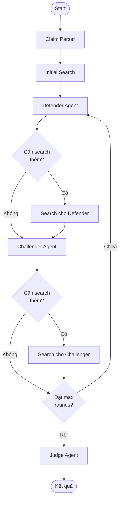

# MAD System for Fake News Detection

## Multi-Agent Debate System — Thiết Kế Chi Tiết

> Hệ thống sử dụng nhiều agent LLM tranh luận với nhau để đánh giá độ tin cậy của một tin tức,
> lấy cảm hứng từ bài báo **Tool-MAD** (2026).

---

## 1. Tổng Quan Hệ Thống

### Mục tiêu
Xây dựng hệ thống multi-agent debate sử dụng LangGraph, trong đó các agent LLM đóng vai trò khác nhau để **tranh luận** và **đánh giá** xem một tin tức có phải tin giả hay không, đưa ra **phần trăm tin cậy** kèm giải thích.

### Kiến Trúc Tổng Quan

```
┌──────────────────────────────────────────────────────────────────┐
│                        USER INPUT                                │
│                   (Đoạn tin tức cần kiểm tra)                    │
└──────────────────────┬───────────────────────────────────────────┘
                       │
                       ▼
              ┌─────────────────┐
              │  Claim Parser   │  Trích xuất các claim chính
              │     Agent       │  từ đoạn tin tức
              └────────┬────────┘
                       │
                       ▼
              ┌─────────────────┐
              │  Search Agent   │  Tìm kiếm thông tin ban đầu
              │  (Web Search)   │  từ danh sách nguồn tin cậy
              └────────┬────────┘
                       │
           ┌───────────┴───────────┐
           │                       │
           ▼                       ▼
   ┌───────────────┐      ┌───────────────┐
   │   Defender     │◄────►│  Challenger    │    Tranh luận
   │   Agent        │      │  Agent         │    nhiều vòng
   │ (Tin thật)     │      │ (Tin giả)      │
   └───────┬───────┘      └───────┬────────┘
           │    ▲                  │    ▲
           │    │  Yêu cầu search  │    │
           │    └──────────────────┘    │
           │           │               │
           │    ┌──────▼───────┐       │
           │    │ Search Agent │       │
           │    │ (Adaptive)   │       │
           │    └──────────────┘       │
           │                           │
           └───────────┬───────────────┘
                       │
                       ▼
              ┌─────────────────┐
              │   Judge Agent   │  Đánh giá toàn bộ quá trình
              │                 │  tranh luận → phán quyết
              └────────┬────────┘
                       │
                       ▼
              ┌─────────────────┐
              │    KẾT QUẢ      │  % tin cậy + giải thích
              │                 │  + nguồn dẫn chứng
              └─────────────────┘
```

---

## 2. Các Agent Chi Tiết

### 2.1. Claim Parser Agent

| Thuộc tính | Chi tiết |
|------------|----------|
| **Vai trò** | Trích xuất các claim (tuyên bố) chính từ đoạn tin tức |
| **Input** | Đoạn tin tức gốc từ user |
| **Output** | Danh sách claims cần xác minh |
| **Tool** | Không |

**Tại sao cần?**
- Một đoạn tin tức có thể chứa nhiều tuyên bố khác nhau
- Tách riêng từng claim giúp tranh luận **tập trung** và **có chiều sâu**
- Agent tranh luận dễ dàng xử lý từng claim hơn là cả đoạn văn dài

**Ví dụ:**
```
Input: "Theo nghiên cứu mới nhất của Đại học Harvard, uống 3 ly cà phê 
mỗi ngày giúp giảm 50% nguy cơ ung thư gan. Nghiên cứu được thực hiện 
trên 10,000 người trong 5 năm."

Output:
- Claim 1: "Đại học Harvard có nghiên cứu về cà phê và ung thư gan"
- Claim 2: "Uống 3 ly cà phê/ngày giảm 50% nguy cơ ung thư gan"
- Claim 3: "Nghiên cứu trên 10,000 người trong 5 năm"
```

---

### 2.2. Search Agent

| Thuộc tính | Chi tiết |
|------------|----------|
| **Vai trò** | Tìm kiếm thông tin liên quan từ các nguồn tin tức |
| **Input** | Query tìm kiếm (từ Claim Parser hoặc từ Debater) |
| **Output** | Danh sách kết quả + Source Credibility Score |
| **Tool** | Web Search API (Tavily / SerpAPI) |

#### Source Credibility Score (Phân loại nguồn)

Sử dụng hệ thống **whitelist phân tier** — danh sách nguồn tin cậy được chọn trước:

| Tier | Credibility | Ví dụ nguồn |
|------|-------------|-------------|
| **Tier 1** (0.9 - 1.0) | Rất cao | Reuters, AP News, BBC, WHO, các tổ chức chính phủ |
| **Tier 2** (0.7 - 0.89) | Cao | VnExpress, Tuổi Trẻ, Thanh Niên, CNN, NYT |
| **Tier 3** (0.5 - 0.69) | Trung bình | Wikipedia, các trang tin phổ biến |
| **Tier 4** (0.2 - 0.49) | Thấp | Blog, forum, trang tin không rõ nguồn gốc |
| **Không xác định** (0.3) | Mặc định | Nguồn không có trong whitelist |

> **Lưu ý**: Search Agent chỉ tìm kiếm từ danh sách nguồn được chọn trước,
> nhưng mỗi nguồn vẫn có credibility score khác nhau — không coi mọi kết quả
> search đều là "sự thật".

#### Adaptive Search (Tìm kiếm thích ứng)

Search Agent được gọi ở **2 thời điểm**:
1. **Trước vòng 1**: Tìm kiếm sơ bộ dựa trên claims
2. **Giữa các vòng tranh luận**: Tìm kiếm theo yêu cầu cụ thể của debater

```
Debater yêu cầu: "Tìm thông tin về nghiên cứu Harvard năm 2024 
                   về cà phê và ung thư gan"
                   
Search Agent: → Tìm kiếm trên các nguồn whitelist
              → Trả về kết quả + credibility score mỗi nguồn
```

---

### 2.3. Defender Agent (Bảo Vệ Tin Thật)

| Thuộc tính | Chi tiết |
|------------|----------|
| **Vai trò** | Lập luận rằng tin tức là **THẬT** |
| **Input** | Claims + Evidence từ Search Agent + Lập luận đối thủ |
| **Output** | Lập luận bảo vệ + Yêu cầu search mới (nếu cần) |
| **Tool** | Gửi query cho Search Agent |

### 2.4. Challenger Agent (Bảo Vệ Tin Giả)

| Thuộc tính | Chi tiết |
|------------|----------|
| **Vai trò** | Lập luận rằng tin tức là **GIẢ** |
| **Input** | Claims + Evidence từ Search Agent + Lập luận đối thủ |
| **Output** | Lập luận phản bác + Yêu cầu search mới (nếu cần) |
| **Tool** | Gửi query cho Search Agent |

#### Cấu trúc response mỗi vòng (áp dụng cho cả Defender & Challenger)

Mỗi vòng (từ vòng 2 trở đi), mỗi debater trả lời **1 lần duy nhất** gồm 2 phần:

```
┌─────────────────────────────────────────────────────┐
│  PHẦN 1: PHẢN BÁC LẬP LUẬN ĐỐI PHƯƠNG             │
│                                                      │
│  - Chỉ ra điểm sai/yếu trong lập luận đối thủ      │
│  - Dẫn nguồn (kèm credibility) để bác bỏ           │
│  - Chỉ ra nếu đối thủ dùng nguồn không tin cậy     │
├─────────────────────────────────────────────────────┤
│  PHẦN 2: BẢO VỆ & BỔ SUNG LẬP LUẬN CỦA MÌNH       │
│                                                      │
│  - Phản hồi lại phản bác của đối thủ về lập luận    │
│    mình ở vòng trước                                │
│  - Bổ sung bằng chứng mới (nếu có từ search mới)   │
│  - Củng cố lập luận                                 │
├─────────────────────────────────────────────────────┤
│  YÊU CẦU SEARCH (tùy chọn)                          │
│                                                      │
│  - Query cụ thể cần Search Agent tìm thêm           │
│  - Dựa trên điểm yếu cần bổ sung hoặc              │
│    lập luận đối thủ cần kiểm chứng                  │
└─────────────────────────────────────────────────────┘
```

---

### 2.5. Judge Agent (Phán Quyết)

| Thuộc tính | Chi tiết |
|------------|----------|
| **Vai trò** | Đánh giá toàn bộ cuộc tranh luận, đưa ra phán quyết cuối cùng |
| **Input** | Toàn bộ lịch sử tranh luận (tất cả các vòng) + Source info |
| **Output** | Phán quyết + % tin cậy + Giải thích chi tiết |
| **Tool** | Không |

#### Thời điểm đánh giá

Judge **KHÔNG** tham gia trong quá trình tranh luận. Judge chỉ đánh giá **sau vòng cuối cùng**, dựa trên **toàn bộ lịch sử** cuộc tranh luận.

#### Tiêu chí đánh giá

Judge đánh giá dựa trên **5 tiêu chí** sau:

| # | Tiêu chí | Mô tả | Trọng số |
|---|----------|--------|----------|
| 1 | **Chất lượng bằng chứng** | Bên nào có nguồn tin cậy hơn (dựa trên credibility score)? | ⭐⭐⭐ |
| 2 | **Hiệu quả phản bác** | Bên nào phản bác được nhiều điểm của đối thủ hơn? | ⭐⭐⭐ |
| 3 | **Điểm chưa bác bỏ** | Lập luận nào vẫn đứng vững chưa bị phản bác? | ⭐⭐⭐ |
| 4 | **Tính nhất quán** | Bên nào giữ lập luận nhất quán, không mâu thuẫn qua các vòng? | ⭐⭐ |
| 5 | **Faithfulness** | Bên nào lập luận đúng với evidence, không bịa thêm thông tin? | ⭐⭐⭐ |

#### Output của Judge

```
{
  "verdict": "LIKELY_FAKE" | "LIKELY_REAL" | "UNCERTAIN",
  "confidence_percent": 82,
  "reasoning": "Giải thích chi tiết tại sao đưa ra phán quyết này...",
  "evaluation": {
    "defender_score": {
      "evidence_quality": 4,      // /10
      "rebuttal_effectiveness": 3, // /10
      "unrefuted_points": 2,      // /10
      "consistency": 7,           // /10
      "faithfulness": 6           // /10
    },
    "challenger_score": {
      "evidence_quality": 8,
      "rebuttal_effectiveness": 8,
      "unrefuted_points": 7,
      "consistency": 8,
      "faithfulness": 9
    }
  },
  "key_evidence": [
    "Reuters (0.95): Không tìm thấy nghiên cứu Harvard nào...",
    "WHO (0.95): Chưa có bằng chứng cà phê giảm ung thư 50%..."
  ],
  "unresolved_points": [
    "Defender chưa cung cấp được link nghiên cứu cụ thể..."
  ],
  "source_summary": {
    "defender": { "avg_credibility": 0.45, "source_count": 3 },
    "challenger": { "avg_credibility": 0.88, "source_count": 5 }
  }
}
```

---

## 3. Flow Chi Tiết Theo Vòng

### Vòng 0: Khởi Tạo

```
User nhập tin tức
    │
    ▼
Claim Parser trích xuất claims
    │
    ▼
Search Agent tìm kiếm sơ bộ cho từng claim
    │ (từ danh sách nguồn whitelist)
    │
    ▼
Evidence ban đầu + Credibility Scores sẵn sàng
```

### Vòng 1: Lập Luận Mở Đầu

```
Defender nhận claims + evidence
    → Đưa ra lập luận ban đầu: TIN NÀY LÀ THẬT vì...
    → Dẫn nguồn kèm credibility
    → (Tùy chọn) Yêu cầu search thêm

Challenger nhận claims + evidence + lập luận Defender
    → Đưa ra lập luận ban đầu: TIN NÀY LÀ GIẢ vì...
    → Dẫn nguồn kèm credibility  
    → (Tùy chọn) Yêu cầu search thêm
```

### Vòng 2..N: Tranh Luận

```
Search Agent tìm theo yêu cầu từ vòng trước (nếu có)
    │
    ▼
Defender ĐỌC lập luận Challenger vòng trước
    → PHẦN 1: Phản bác Challenger
    → PHẦN 2: Bảo vệ lập luận mình
    → Yêu cầu search mới (nếu cần)
    │
    ▼
Search Agent tìm theo yêu cầu Defender (nếu có)
    │
    ▼
Challenger ĐỌC lập luận Defender vòng này
    → PHẦN 1: Phản bác Defender  
    → PHẦN 2: Bảo vệ lập luận mình
    → Yêu cầu search mới (nếu cần)
```

### Điều kiện dừng tranh luận

Tranh luận dừng khi đạt **một trong các điều kiện**:
- Đạt **số vòng tối đa** (mặc định: 3 vòng)
- *(Nâng cao)* Cả 2 bên không đưa ra được lập luận mới

### Vòng Cuối: Judge Phán Quyết

```
Judge nhận TOÀN BỘ lịch sử:
    ├── Claims gốc
    ├── Vòng 1: Defender nói... | Challenger nói...
    ├── Vòng 2: Defender phản bác... | Challenger phản bác...
    ├── ...
    └── Tất cả sources + credibility scores
    │
    ▼
Judge đánh giá theo 5 tiêu chí
    │
    ▼
Output: Verdict + % Confidence + Giải thích
```

---

## 4. Stack Công Nghệ

| Component | Công nghệ | Ghi chú |
|-----------|-----------|---------|
| **Orchestration** | LangGraph | State machine quản lý debate flow |
| **LLM API** | OpenAI / Gemini / Claude | Model cho tất cả agent |
| **Web Search** | Tavily API | Tích hợp tốt với LangChain, hỗ trợ filter domain |
| **Source Whitelist** | Config file (JSON/YAML) | Danh sách nguồn + credibility tier |
| **Frontend** | Gradio hoặc Streamlit | Demo UI |
| **Language** | Python | — |

---

## 5. LangGraph State Machine

### State Definition

```python
class MADState(TypedDict):
    # Input
    original_news: str                    # Tin tức gốc
    claims: list[str]                     # Claims đã trích xuất
    
    # Search results
    search_results: list[dict]            # Kết quả search + credibility
    
    # Debate history
    current_round: int                    # Vòng hiện tại
    max_rounds: int                       # Số vòng tối đa
    defender_arguments: list[str]         # Lịch sử lập luận Defender
    challenger_arguments: list[str]       # Lịch sử lập luận Challenger
    
    # Search requests from debaters
    pending_search_queries: list[str]     # Query cần search tiếp
    
    # Final result
    verdict: str                          # LIKELY_FAKE / LIKELY_REAL / UNCERTAIN
    confidence: float                     # % tin cậy
    judge_reasoning: str                  # Giải thích của Judge
```

### Graph Flow



---

## 6. Ví Dụ Minh Họa

### Input
> "Theo nghiên cứu của Đại học Harvard năm 2024, uống 3 ly cà phê mỗi ngày 
> giúp giảm 50% nguy cơ ung thư gan."

### Claim Parser Output
1. Đại học Harvard có nghiên cứu năm 2024 về cà phê và ung thư gan
2. Uống 3 ly cà phê/ngày giảm 50% nguy cơ ung thư gan

### Vòng 1

**Defender:**
> Cà phê đã được nhiều nghiên cứu chứng minh có lợi cho sức khỏe gan.
> Theo VnExpress (credibility 0.85), nghiên cứu đăng trên BMJ cho thấy
> uống cà phê có liên quan đến giảm nguy cơ bệnh gan...
> 
> *Yêu cầu search: "Harvard coffee liver cancer study 2024"*

**Challenger:**
> Con số "giảm 50%" là quá cao và không hợp lý với các nghiên cứu y khoa.
> Theo WHO (credibility 0.95), không có nghiên cứu nào kết luận cà phê 
> "giảm 50%" nguy cơ ung thư. Các nghiên cứu chỉ nói "có liên quan"...
>
> *Yêu cầu search: "WHO coffee cancer recommendation"*

### Vòng 2

**Defender:**
> [PHẢN BÁC] Challenger nói con số 50% quá cao, nhưng tôi tìm thấy trên
> PubMed một meta-analysis cho thấy cà phê giảm 40% nguy cơ... Tuy nhiên
> tôi thừa nhận chưa tìm được nghiên cứu cụ thể của Harvard 2024.
>
> [BẢO VỆ] Lập luận cà phê tốt cho gan vẫn đúng...

**Challenger:**
> [PHẢN BÁC] Defender thừa nhận không tìm được nghiên cứu Harvard — đây là
> dấu hiệu tin giả. Meta-analysis Defender dẫn nói 40%, không phải 50%.
>
> [BẢO VỆ] WHO (0.95) vẫn chưa công nhận con số cụ thể nào...

### Judge Verdict

```
Verdict: LIKELY_FAKE (78% confidence)

Lý do:
1. Defender không tìm được nghiên cứu Harvard 2024 cụ thể (claim 1 không xác minh được)
2. Con số "50%" không khớp với bất kỳ nghiên cứu uy tín nào (claim 2 bị bác bỏ)
3. Challenger có nguồn tin cậy hơn (WHO 0.95 vs blog cá nhân 0.4)
4. Defender thừa nhận thiếu bằng chứng — điểm yếu nghiêm trọng

Tuy nhiên không đánh giá 100% vì: cà phê có lợi cho gan là thông tin đúng, 
chỉ là con số và nguồn trích dẫn có vấn đề.
```
